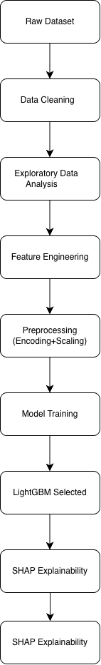
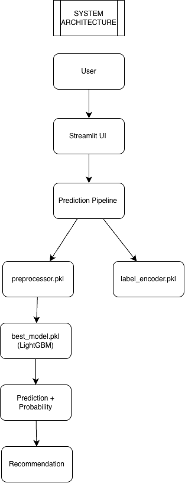
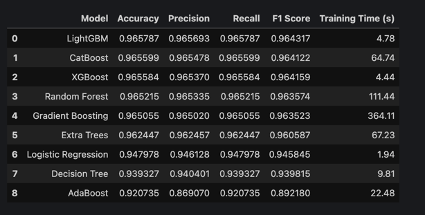
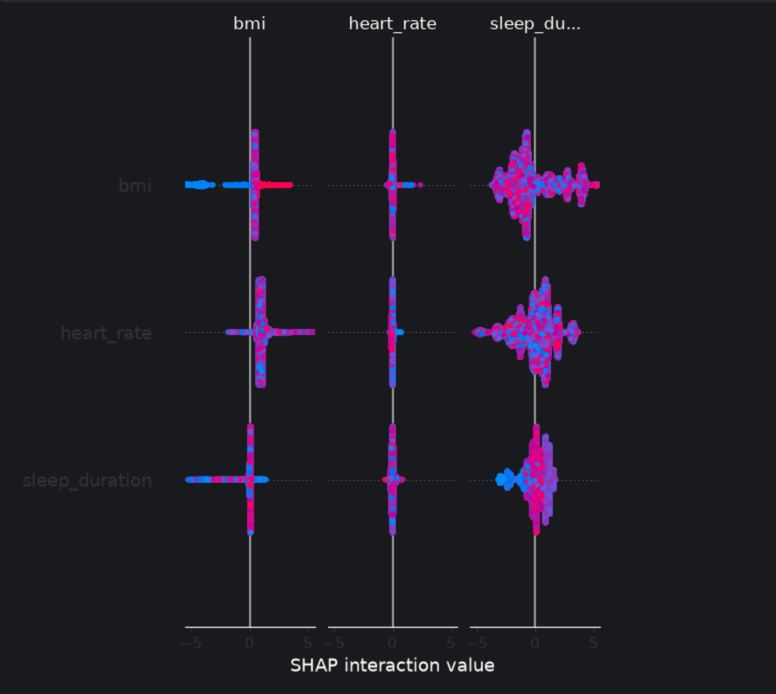
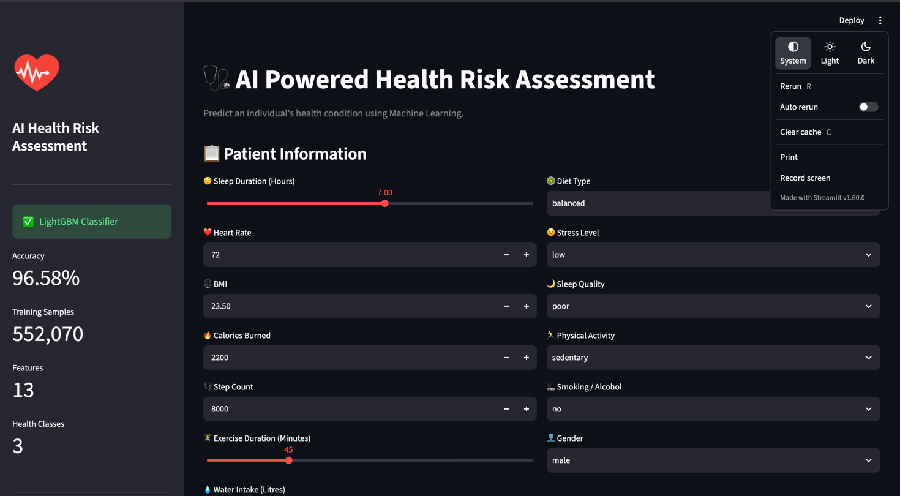
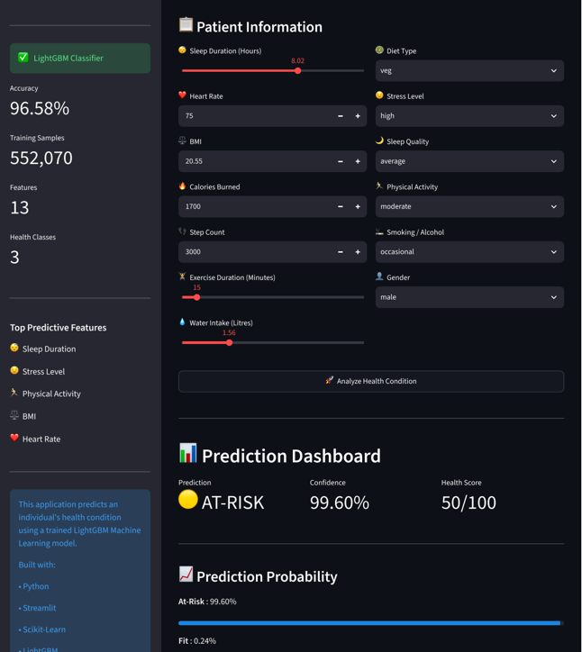
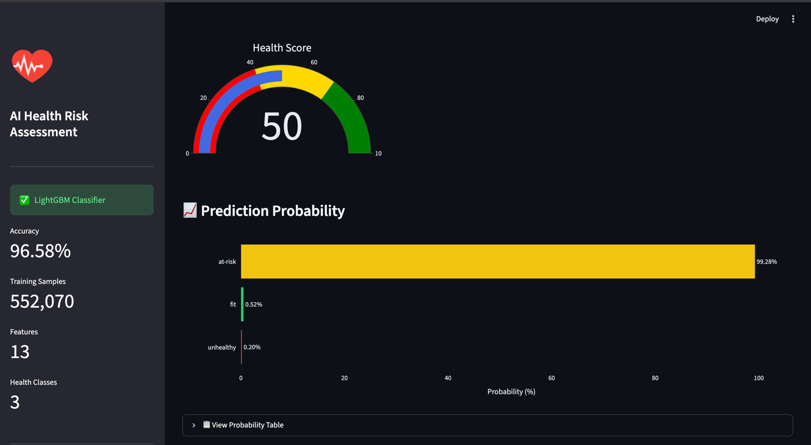
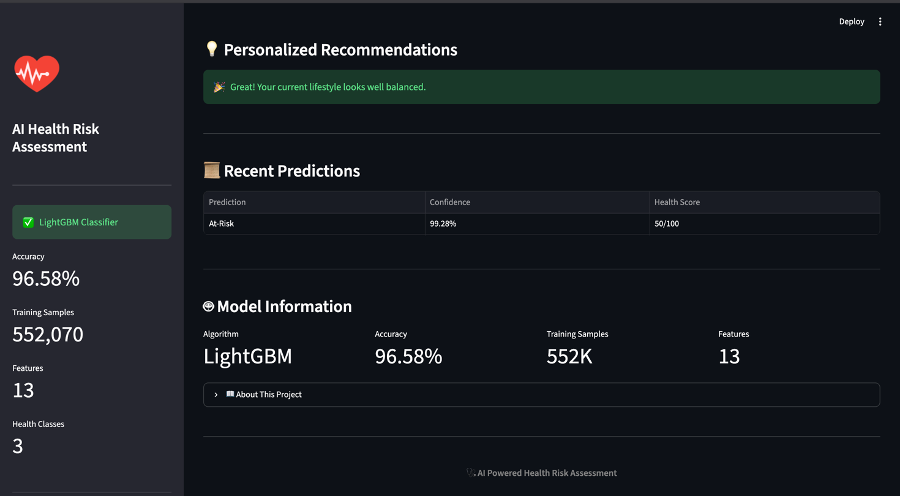

# 🩺 AI Health Risk Assessment using Machine Learning


## 🌐 Live Demo

### 👀 https://ai-health-risk-predictor.streamlit.app/

---

## 📌 Project Overview

AI Health Risk Assessment is an end-to-end Machine Learning project that predicts an individual's health condition based on lifestyle and health-related indicators.

The application analyzes parameters such as:

- 😴 Sleep Duration
- ❤️ Heart Rate
- ⚖️ BMI
- 🔥 Calories Burned
- 👣 Step Count
- 🏃 Exercise Duration
- 💧 Water Intake
- 🥗 Diet Type
- 😟 Stress Level
- 🌙 Sleep Quality
- 🏋️ Physical Activity
- 🚬 Smoking / Alcohol
- 👤 Gender

The trained LightGBM model classifies individuals into one of the following categories:

- ✅ Fit
- ⚠️ At-Risk
- 🚨 Unhealthy

---

# 🎯 Features

- End-to-End Machine Learning Pipeline
- Advanced Feature Engineering
- Model Comparison
- LightGBM Classifier
- SHAP Explainability
- Interactive Streamlit Dashboard
- Prediction Confidence
- Probability Visualization
- Personalized Health Recommendations
- Live Deployment

---

# 🛠 Tech Stack

| Category       | Technologies.          |
|-----------     |--------------          |
| Language.      | Python                 |
| ML             | Scikit-Learn, LightGBM |
| Explainability | SHAP                   |
| Data Analysis  | Pandas, NumPy.         |
| Visualization  | Plotly, Matplotlib     |
| Web App        | Streamlit              |
| Version Control| Git & GitHub           |

---

# 📂 Project Workflow



---

# 🏗 Project Architecture



---

# 📊 Model Comparison

Several classification algorithms were evaluated.

The final model selected was **LightGBM** due to its superior performance.



---

# 📈 SHAP Explainability

Feature importance was analyzed using SHAP.

This helps explain why the model predicts a particular health condition.



---

# 🖥 Application Screenshots

## Home Page



---

## Prediction Dashboard



---

## Prediction Probabilities



---

## Personalized Recommendations



---

# 📁 Project Structure

```text
Health-Condition-Prediction
│
├── app/
│   └── app.py
│
├── artifacts/
│   ├── best_model.pkl
│   ├── preprocessor.pkl
│   ├── label_encoder.pkl
│   └── model_comparison.csv
│
├── data/
│
├── docs/
│
├── notebooks/
│
├── src/
│   ├── data/
│   ├── features/
│   ├── models/
│   ├── pipeline/
│   └── profiling/
│
├── requirements.txt
└── README.md
```

---

# 🚀 Installation

Clone the repository

```bash
git clone https://github.com/Gyanvi908/Health-Condition-Prediction.git
```

Go inside the project

```bash
cd Health-Condition-Prediction
```

Install dependencies

```bash
pip install -r requirements.txt
```

Run the application

```bash
streamlit run app/app.py
```

---

# 📈 Model Performance

| Metric | Score |
|---------|-------|
| Algorithm | LightGBM |
| Accuracy | **96.58%** |
| Classes | 3 |
| Features | 13 |

---

# 📌 Future Improvements

- Deep Learning Models
- Explainable AI Dashboard
- Cloud Database Integration
- User Authentication
- Patient History Tracking
- REST API Deployment
- Docker Support

---

# 👨‍💻 Author

**Sumiran**

GitHub:

https://github.com/Sumiran7

---

# ⭐ If you like this project

Please consider giving it a ⭐ on GitHub.
